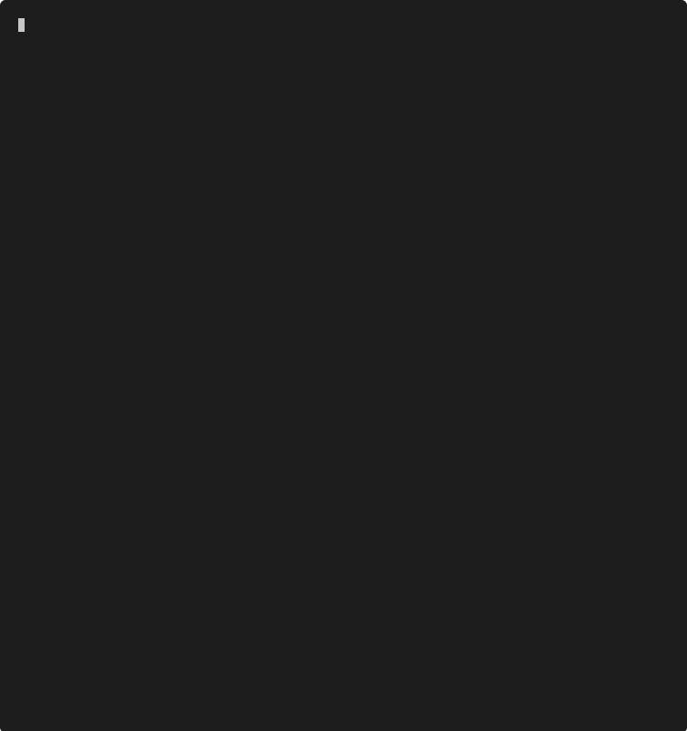

# The Way (`the-way`)
A code snippets manager for your terminal.

Easily record and retrieve snippets you use every day, or once in a blue moon,
without having to spin up a browser. Just call `the-way` to add a snippet with a 
description, a language, and some tags attached. `the-way search` fuzzy 
searches your snippets library (with optional filters on language and tags) and 
lets you copy a particular snippet to your clipboard, so you can paste 
it into whatever editor or IDE you're working with.

See it in action:

**Currently tested on nightly rust**

## Features
- [X] Recognizes language extension to enable syntax highlighting in $EDITOR (if the editor supports it)
- [X] Configurable syntax highlighting themes for display via `the-way themes`
- [ ] Shell completion (in progress)
- [ ] Import/export to JSON (in progress)
- [ ] Language and code statistics

## Why "The Way"?
The name is a reference to [the Way of Mrs.Cosmopolite](https://wiki.lspace.org/mediawiki/The_Way_of_Mrs._Cosmopilite), kōans for every situation.