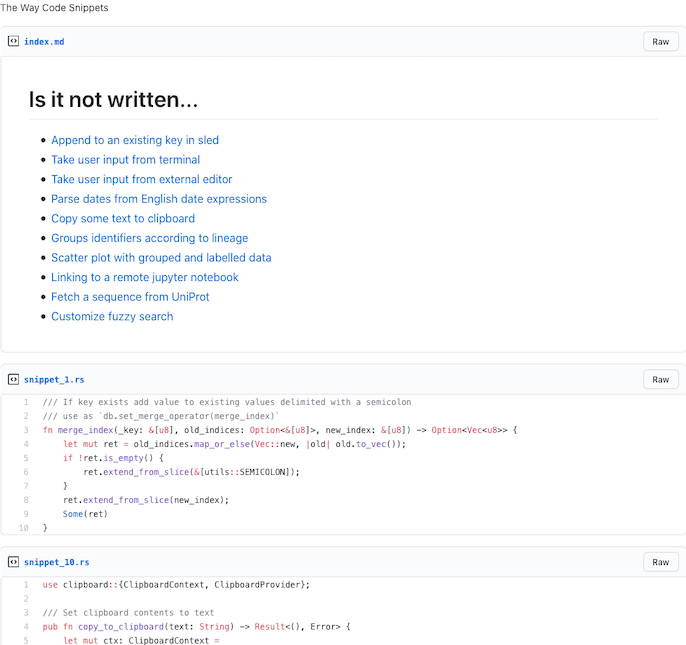

[](https://crates.io/crates/the-way)
[](https://travis-ci.org/out-of-cheese-error/the-way)

# The Way
A code snippets manager for your terminal.

Record and retrieve snippets you use every day, or once in a blue moon,
without having to spin up a browser. Just call `the-way new` to add a snippet with a 
description, a language, and some tags attached. `the-way search` fuzzy 
searches your snippets library (with optional filters on language and tags) and 
lets you copy a particular snippet to your clipboard, so you can paste 
it into whatever editor or IDE you're working with.

See it in action (with some self-referential examples):


> made with [Terminalizer](https://github.com/faressoft/terminalizer)

## Install

### Binaries
See the [releases](https://github.com/out-of-cheese-error/the-way/releases/latest)

* OSX - allow `the-way` via System Preferences (necessary in Catalina at least)
* Linux - `chmod +x the-way` 
* Currently doesn't work on Windows (waiting on [this issue](https://github.com/lotabout/skim/issues/293))

### With cargo
```bash
cargo install the-way
```

**!!!NOTE: upgrading from <v0.5 needs a database migration, instructions below:**
* Before upgrade 
```bash
the-way export > snippets.json
the-way clear
```
* After upgrade
```bash
the-way import snippets.json
```

## Usage
```
Record, retrieve, search, and categorize code snippets

USAGE:
    the-way <SUBCOMMAND>

FLAGS:
    -h, --help
            Prints help information

    -V, --version
            Prints version information


SUBCOMMANDS:
    new         Add a new snippet
    search      Fuzzy search and copy selected to clipboard
    sync        Sync snippets to a Gist
    edit        Change snippet
    del         Delete snippet
    cp          Copy snippet to clipboard
    view        View snippet
    list        Lists (optionally filtered) snippets
    import      Imports code snippets from JSON
    export      Saves (optionally filtered) snippets to JSON
    clear       Clears all data
    complete    Generate shell completions
    themes      Manage syntax highlighting themes
    config      Manage the-way data locations
    help        Prints this message or the help of the given subcommand(s)
```

## Features
### Main features
* Add and edit code snippets
* Interactive fuzzy search
* Filter by tag, date, and/or language
* Copies selected snippet to clipboard
* Import / export via JSON

### Sync to Gist (new from v0.5.0!)
`the-way sync` syncs snippets to a Gist, each named `snippet_<index>.<extension`, with an `index.md` file linking each snippet's description. 
Local updates and deletions are uploaded to the Gist and Gist updates are downloaded.



This functionality needs a [GitHub access token](https://github.com/settings/tokens/new) with the "gist" scope. 
Either enter this token on running `sync` for the first time or set it to the environment variable `$THE_WAY_GITHUB_TOKEN`.

### Shell completions
```bash
the-way complete zsh > .oh-my-zsh/completions/_the-way
exec zsh
```

### Syntax highlighting
The Way maps languages to their extensions and uses this to
1. Enable syntax highlighting in `$EDITOR` (if the editor supports it),
2. Upload snippets to Gist with the correct extension,
3. Add a small colored language indicator (GitHub-flavored)
4. Syntax highlight code in the terminal
The last point can be customized via `the-way themes`. 

Use `the-way themes set <theme>` to enable a theme.

**Default themes:**
```
Darcula
InspiredGitHub
Solarized (dark)
Solarized (light)
base16-eighties.dark
base16-mocha.dark
base16-ocean.dark
base16-ocean.light
base16-tomorrow.dark
base16-twilight.dark
```

Use `the-way themes add <theme.tmTheme>` to add a new theme to your themes folder.
Theme files need to be in Sublime's [.tmTheme](https://www.sublimetext.com/docs/3/color_schemes_tmtheme.html) format. 
Searching GitHub for [.tmTheme](https://github.com/search?q=.tmTheme) pulls up some examples. 

`the-way themes list` shows all available themes.

### Configuration
The default config TOML file is located in
* Linux: `/home/<username>/.config`
* Mac: `/Users/<username>/Library/Preferences`

This file contains locations of data directories, which are automatically created and set according to XDG and Standard Directories guidelines.
Change this by creating a config file with `the-way config default > config.toml` and then setting the environment variable `$THE_WAY_CONFIG` to point to this file.

## Why "The Way"?
The name is a reference to [the Way of Mrs.Cosmopilite](https://wiki.lspace.org/mediawiki/The_Way_of_Mrs._Cosmopilite), kōans for every situation.
