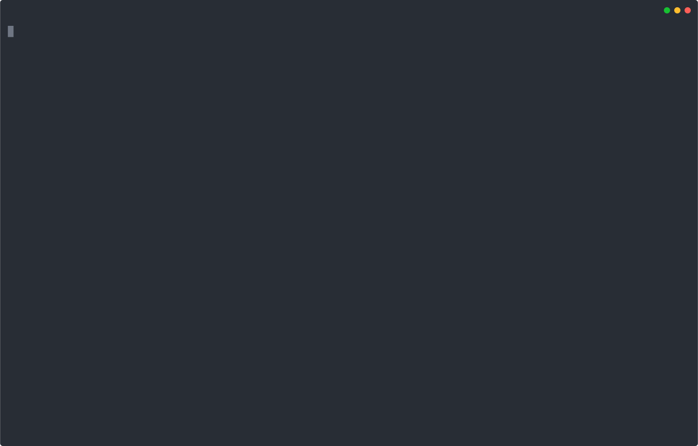
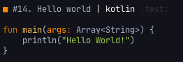

[](https://crates.io/crates/the-way)
[](https://travis-ci.org/out-of-cheese-error/the-way)
[](https://GitHub.com/out-of-cheese-error/the-way/releases/)
[](https://github.com/out-of-cheese-error/the-way/blob/master/LICENSE)
   
# The Way
A code snippets manager for your terminal.

Record and retrieve snippets you use every day, or once in a blue moon,
without having to spin up a browser. Just call `the-way new` to add a snippet with a 
description, a language, and some tags attached. 

`the-way search` fuzzy searches your snippets library (with optional filters on language and tags) and 
lets you 
* edit a snippet with Shift-Right
* delete a snippet with Shift-Left
* copy a particular snippet to your clipboard (with Enter), so you can paste it into whatever editor or IDE you're working with.

See it in action (with some self-referential examples):



> made with [asciinema](https://github.com/asciinema/asciinema), [svg-term-cli](https://github.com/marionebl/svg-term-cli), and [svgembed](https://github.com/miraclx/svgembed)

Table of Contents
=================

* [Install](#install)
  * [Binaries](#binaries)
  * [With brew](#with-brew)
  * [With cargo](#with-cargo)
  * [With yay](#with-yay)
* [Usage](#usage)
* [Features](#features)
  * [Main features](#main-features)
  * [Shell commands](#shell-commands)
  * [Sync to Gist](#sync-to-gist)
  * [Shell completions](#shell-completions)
  * [Syntax highlighting](#syntax-highlighting)
  * [Configuration](#configuration)
* [Why "The Way"?](#why-the-way)


# Install

## Binaries
See the [releases](https://github.com/out-of-cheese-error/the-way/releases/latest)

* OSX - allow `the-way` via System Preferences (necessary in Catalina at least)
* Linux - `chmod +x the-way` 
* Currently doesn't work on Windows (waiting on [this issue](https://github.com/lotabout/skim/issues/293))

## With brew
```bash
brew tap out-of-cheese-error/the-way && brew install the-way
```

## With cargo
```bash
cargo install the-way
```

## With yay
```bash
yay -S the-way-git
```

**Some upgrades need a database migration** (mentioned in the release notes):

* Before upgrade 
```bash
the-way export > snippets.json
the-way clear
```
* After upgrade
```bash
the-way import snippets.json
```

# Usage
```
Record, retrieve, search, and categorize code snippets

USAGE:
    the-way <SUBCOMMAND>

FLAGS:
    -h, --help       Prints help information
    -V, --version    Prints version information

SUBCOMMANDS:
    new         Add a new code snippet
    cmd         Add a new shell snippet
    search      Fuzzy search to find a snippet and copy, edit or delete it
    sync        Sync snippets to a Gist
    list        Lists (optionally filtered) snippets
    import      Imports code snippets from JSON
    export      Saves (optionally filtered) snippets to JSON
    clear       Clears all data
    complete    Generate shell completions
    themes      Manage syntax highlighting themes
    config      Manage the-way data locations
    edit        Change snippet
    del         Delete snippet
    cp          Copy snippet to clipboard
    view        View snippet
    help        Prints this message or the help of the given subcommand(s)
```

# Features

## Main features
* Add code and shell snippets
* Interactive fuzzy search with edit, delete and copy to clipboard functionality
* Filter by tag, date, language and/or regex pattern
* Import / export via JSON
* Import from Gist (with `the-way import -g <gist_url>`)

## Shell commands
`the-way cmd` (inspired by [pet](https://github.com/knqyf263/pet)) makes it easier to save single-line 
bash/shell snippets with variables that can be filled in whenever the snippet is needed. 

Add the following function according to your shell of choice. Every time you spend ages hand-crafting the perfect command: run it, 
close all the stackoverflow tabs, and run `cmdsave` to save it to `the-way`.

### bash
```shell script
function cmdsave() {
  PREV=$(echo `history | tail -n2 | head -n1` | sed 's/[0-9]* //')
  sh -c "the-way cmd `printf %q "$PREV"`"
}
```
### zsh
 
```shell script
function cmdsave() {
  PREV=$(fc -lrn | head -n 1)
  sh -c "the-way cmd `printf %q "$PREV"`"
}
```

### fish

```shell script
function cmdsave
  set line (echo $history[1])
  the-way cmd $line
end
```

You'll usually want different parameters each time you need a shell command: save variables in a shell snippet as `<param>` or `<param=default_value>` and 
every time you select it (with `search` or `cp`), you can interactively fill them in (or keep the defaults). Parameters can appear more than once, 
just use the same name and write in the default the first time it's used.

Here's another self-referential example that saves a shell command to add new language syntaxes:


> made with [asciinema](https://github.com/asciinema/asciinema), [svg-term-cli](https://github.com/marionebl/svg-term-cli), and [svgembed](https://github.com/miraclx/svgembed)

## Sync to Gist
`the-way sync` syncs snippets to a Gist, each named `snippet_<index>.<extension>`, with an `index.md` file linking each snippet's description. 
Local updates and deletions are uploaded to the Gist and Gist updates are downloaded.


This functionality needs a [GitHub access token](https://github.com/settings/tokens/new) with the "gist" scope. 
Either enter this token on running `sync` for the first time or set it to the environment variable `$THE_WAY_GITHUB_TOKEN`.

## Shell completions
```bash
the-way complete zsh > .oh-my-zsh/completions/_the-way
exec zsh
```

## Syntax highlighting
The Way maps languages to their extensions and uses this to
1. Enable syntax highlighting in `$EDITOR` (if the editor supports it),
2. Upload snippets to Gist with the correct extension,
3. Add a small colored language indicator (GitHub-flavored)
4. Syntax highlight code in the terminal

The last point can be customized via `the-way themes`. 

Use `the-way themes set <theme>` to enable a theme.

Default themes:
```
Darcula
InspiredGitHub
Solarized (dark)
Solarized (light)
base16-eighties.dark
base16-mocha.dark
base16-ocean.dark
base16-ocean.light
base16-tomorrow.dark
base16-twilight.dark
```

Use `the-way themes add <theme.tmTheme>` to add a new theme to your themes folder.
Theme files need to be in Sublime's [.tmTheme](https://www.sublimetext.com/docs/3/color_schemes_tmtheme.html) format. 
Searching GitHub for [.tmTheme](https://github.com/search?q=.tmTheme) pulls up some examples. 

`the-way themes list` shows all available themes.

Use `the-way themes language <language.sublime-syntax>` to add highlight support for a new language 
([many languages](https://github.com/sublimehq/Packages/) are supported by default). 
Syntax files need to be in Sublime's sublime-syntax format.
[Zola](https://github.com/getzola/zola/tree/master/sublime/syntaxes) has a nice collection of such files.

Here's how it looks before and after adding `Kotlin.sublime-syntax`:
* Before:


* After:



To get syntax highlighting for code blocks in markdown files, download and add the patched `Markdown.sublime-syntax` file in this repository, 
taken from [bat](https://github.com/sharkdp/bat/blob/master/assets/patches/Markdown.sublime-syntax.patch) 
(the default syntax file [doesn't do this anymore](https://github.com/sharkdp/bat/issues/963))

## Configuration
The default config TOML file is located in
* Linux: `/home/<username>/.config`
* Mac: `/Users/<username>/Library/Preferences`

This file contains locations of data directories, which are automatically created and set according to XDG and Standard Directories guidelines.
Change this by creating a config file with `the-way config default > config.toml` and then setting the environment variable `$THE_WAY_CONFIG` to point to this file.

# Why "The Way"?
The name is a reference to [the Way of Mrs.Cosmopilite](https://wiki.lspace.org/mediawiki/The_Way_of_Mrs._Cosmopilite), kōans for every situation.
